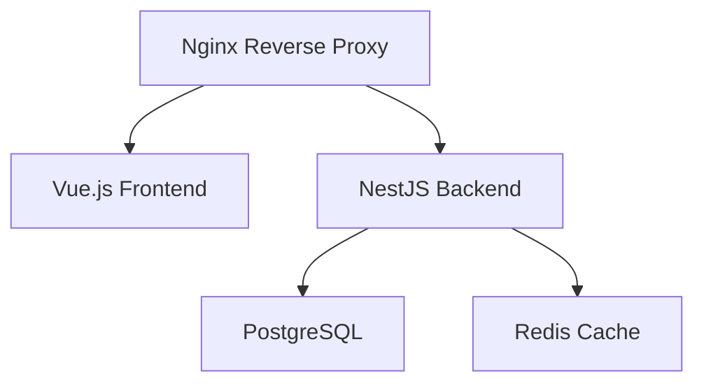

# Docker Configuration

## Overview

The Source Of Truth platform uses Docker and Docker Compose for containerized development and deployment. This setup includes:

- NestJS Backend Service
- Vue.js Frontend Service
- PostgreSQL Database
- Redis Cache
- Nginx Reverse Proxy

## Container Architecture



## Services Configuration

### 1. Backend Service

- NestJS application
- TypeScript runtime
- Node.js v18
- Exposed port: 3000
- Environment variables from `.env`

### 2. Frontend Service

- Vue.js application
- Vite development server
- Node.js v18
- Exposed port: 5173
- Environment variables from `.env`

### 3. PostgreSQL Database

- Version: 14
- Persistent volume for data
- Exposed port: 5432
- Initial database creation
- Automatic migrations

### 4. Redis Cache

- Version: 7
- Persistent volume
- Exposed port: 6379
- Memory management configuration

### 5. Nginx Reverse Proxy

- Latest stable version
- SSL/TLS termination
- Reverse proxy configuration
- Static file serving
- Gzip compression

## Directory Structure

```
docker/
├── backend/
│   └── Dockerfile
├── frontend/
│   └── Dockerfile
├── nginx/
│   ├── Dockerfile
│   └── nginx.conf
├── postgres/
│   └── init.sql
├── .dockerignore
├── docker-compose.yml
└── docker-compose.prod.yml
```

## Environment Variables

### Development (.env)

```env
# Workspace Configuration
COMPOSE_PROJECT_NAME=source_of_truth_dev

# Development Ports
FRONTEND_PORT=5173
BACKEND_PORT=3000

# Database Configuration
POSTGRES_USER=postgres
POSTGRES_PASSWORD=postgres
POSTGRES_DB=source_of_truth
POSTGRES_PORT=5432

# Redis Configuration
REDIS_PORT=6379
```

### Production (.env.prod)

```env
# Additional production-specific variables
NODE_ENV=production
DOMAIN=yourdomain.com
SSL_CERTIFICATE=/etc/nginx/ssl/cert.pem
SSL_KEY=/etc/nginx/ssl/key.pem
```

## Usage

### Development

1. Start all services:

```bash
docker-compose up -d
```

2. View logs:

```bash
docker-compose logs -f [service_name]
```

3. Stop services:

```bash
docker-compose down
```

### Production

1. Build and start:

```bash
docker-compose -f docker-compose.prod.yml up -d
```

2. Scale services:

```bash
docker-compose -f docker-compose.prod.yml up -d --scale backend=3
```

## Database Management

### Migrations

```bash
# Run migrations
docker-compose exec backend npm run migration:run

# Create new migration
docker-compose exec backend npm run migration:generate
```

### Backup & Restore

```bash
# Backup
docker-compose exec postgres pg_dump -U postgres source_of_truth > backup.sql

# Restore
docker-compose exec -T postgres psql -U postgres source_of_truth < backup.sql
```

## Monitoring & Maintenance

### Health Checks

- Backend: `http://localhost:3000/health`
- Frontend: `http://localhost:5173/health`
- Database: `pg_isready` command
- Redis: `redis-cli ping`

### Resource Limits

```yaml
services:
  backend:
    deploy:
      resources:
        limits:
          cpus: "1"
          memory: 1G
        reservations:
          cpus: "0.5"
          memory: 512M
```

## Security Considerations

1. **Container Security**

   - Non-root users
   - Read-only file systems
   - Limited capabilities
   - Resource constraints

2. **Network Security**

   - Internal network isolation
   - Exposed ports minimization
   - TLS/SSL configuration
   - Rate limiting

3. **Data Security**
   - Volume encryption
   - Secure environment variables
   - Regular backups
   - Access control

## Deployment Checklist

- [ ] Environment variables configured
- [ ] SSL certificates in place
- [ ] Database backups configured
- [ ] Health checks implemented
- [ ] Monitoring setup
- [ ] Resource limits set
- [ ] Security measures applied
- [ ] Logging configured
